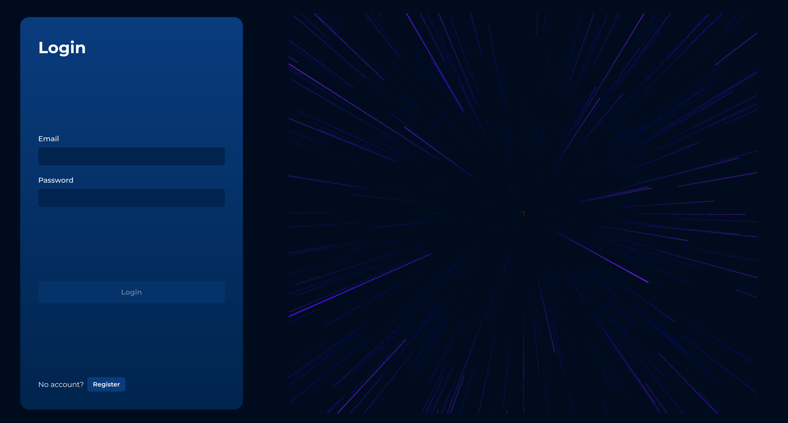
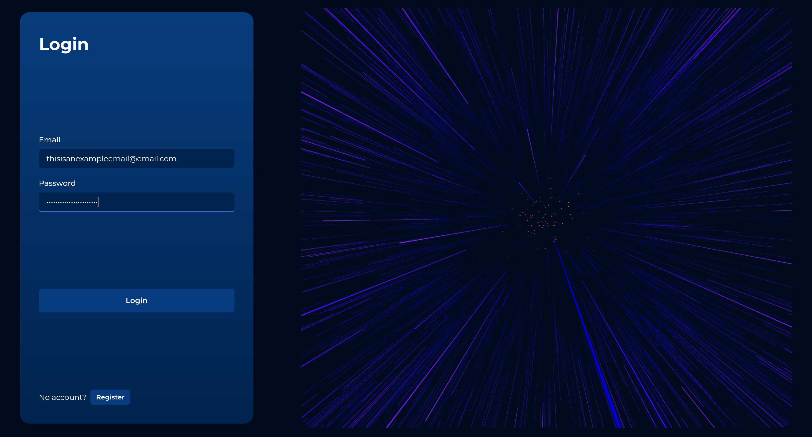
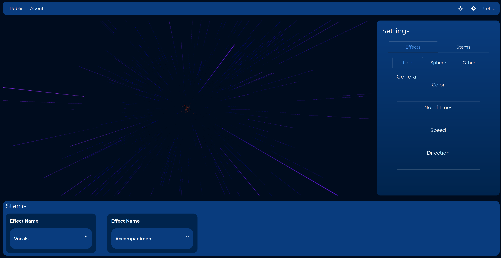

Music Visualization 3D using react-three-fiber.

This is just an example project.

# Setup
Keep two audio files: `vocal.mp3` and `accompaniment.mp3` in [public](./public/).

> Use any signal separation API. Example: [signal_separation](https://github.com/vitrioil/signal_separation)

# Working
This project uses react three fiber for 3D visualization.

Essentially it requires a source (e.g. audio file). Different effects, default consisting of lines and sphere "move" with the source.

In case of an audio signal, if audio amplitude goes up then the sphere radius increases or number of lines increases.

Example Login Screen with 3D visualization.

Speed and Content dependent on form values.
Here the source is the input form text.

Player where effect intensity is dependent on music amplitude.
Example: If vocals are intense then line effect will be more promiment which makes the music "feel alive".
